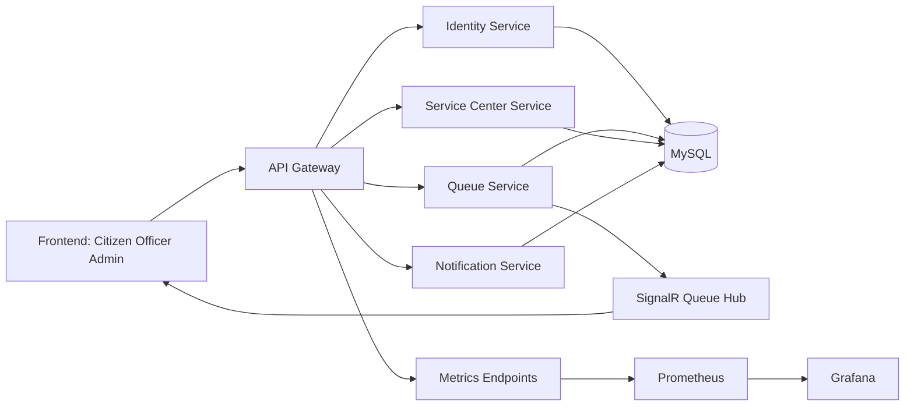

# Qlanka-pro

QueueLanka Pro is a smart queue management platform with token booking, live queue handling, admin analytics, and a full DevOps pipeline (CI/CD, testing, monitoring, performance).

---

## Repository Structure

```
Qlanka-pro/
├── frontend/   # React/Next.js client application
├── backend/    # .NET API server
├── docs/       # Documentation and guides
└── scripts/    # Development and deployment scripts
```

---

## System Architecture

QueueLanka Pro uses a microservices-based architecture with role-based frontend workflows, a central API gateway, domain services, and real-time queue updates.

### Core Components

- Frontend (React + Vite): citizen, officer, and admin user interfaces
- Gateway (QueueLanka.Gateway): single entry point, routing, auth forwarding
- Identity Service (QueueLanka.Identity): authentication, authorization, user management
- Queue Service (QueueLanka.Queue): token lifecycle, counter actions, queue logic, realtime hub events
- Service Center Service (QueueLanka.ServiceCenter): centers and center status management
- Notification Service (QueueLanka.Notification): notification-related workflows
- Shared Library (QueueLanka.Shared): shared contracts and common utilities
- Data Layer (MySQL): persistent storage for users, centers, counters, tokens, appointments, and reports
- Observability: Prometheus for metrics and Grafana for dashboards

### High-Level Flow

1. User actions originate in the frontend (citizen/officer/admin pages).
2. Requests pass through the gateway to the correct backend service.
3. Domain services execute business logic and persist data in MySQL.
4. Queue-related changes emit SignalR hub events for live updates.
5. Frontend clients subscribe to updates and refresh queue state in real time.
6. Metrics are scraped by Prometheus and visualized in Grafana.

### Architecture Diagram



### Backend Service Layout

- backend/QueueLanka.Gateway
- backend/QueueLanka.Identity
- backend/QueueLanka.Queue
- backend/QueueLanka.ServiceCenter
- backend/QueueLanka.Notification
- backend/QueueLanka.Shared

---

## Documentation

See the [docs/](docs/) directory for comprehensive documentation including:

- **[Call Next Token Feature](docs/call-next-token-user-guide.md)**: User guide for officers
- **[Technical API Guide](docs/call-next-token-technical-guide.md)**: Developer documentation
- **[API Contract](docs/call-next-token-api-contract.md)**: Detailed specification for Call Next Token endpoint
- **[Branching Strategy](docs/branching-strategy.md)**: Git workflow guidelines
- **[Supabase Backup Demo Guide](docs/supabase-backup-demo-guide.md)**: Emergency fallback backend setup for demo day

---

## Supabase Backup Mode (Demo Failover)

QueueLanka Pro now includes a backup backend that uses Supabase Postgres. Use this mode only when the primary microservices stack is unavailable during demos.

### Backup Components

- Backup API service: `supabase-backup/server.js`
- Schema + seed scripts: `supabase-backup/sql/001_schema.sql`, `supabase-backup/sql/002_seed.sql`
- Setup guide: `docs/supabase-backup-demo-guide.md`

### Start Backup API Locally

```bash
cd supabase-backup
npm install
npm run start
```

Required environment variables (recommended via local shell/user environment):

- `SUPABASE_URL`
- `SUPABASE_SERVICE_ROLE_KEY`
- `BACKUP_JWT_SECRET`

### Switch Frontend to Backup API

Set:

```env
VITE_API_BASE_URL=http://localhost:7000
```

Then restart frontend. To rollback, restore `VITE_API_BASE_URL` to your gateway URL.

---

## System Options

QueueLanka Pro supports role-based options across citizen, officer, and admin workflows.

### Citizen Options

- Register and login
- View available/open service centers
- Book appointments
- View personal bookings
- View personal tokens
- Cancel waiting tokens
- See live queue changes in real time

### Officer Options

- Login to the officer workstation
- View assigned counter dashboard
- View waiting tokens at assigned counter
- Call next token (FIFO)
- Mark called token as served
- Mark called token as skipped
- Reassign token to another open counter
- View daily counter stats (served, skipped, average service time)
- Manual refresh and reconnect controls for real-time sync

### Admin Options

- Login to admin portal
- Manage users (citizen/officer/admin)
- Manage service centers
- Open/close service centers
- Manage counters per center
- Open/close counters
- Assign officers to counters
- View daily center summary reports

### Realtime and Queueing Options

- SignalR real-time updates for queue events
- Counter-level and center-level queue synchronization
- Token lifecycle states: Waiting, Called, Served, Skipped, Cancelled, Completed, NoShow
- Queue position handling and live waiting-list updates

### API and Integration Options

- REST APIs via Gateway for auth, queue, service-center, and admin workflows
- JWT-based authorization with role checks
- Endpoint coverage for call-next, mark served/skip, reassign, counter management, and reports

### Quality, DevOps, and Observability Options

- CI/CD-ready repository structure for frontend and backend services
- Automated health checks and validation scripts in scripts/
- Smoke and integration test support (including Playwright smoke tests)
- Prometheus metrics scraping
- Grafana dashboards for latency, errors, queue size, and service availability

### Feature Guides

- **Officer dashboard**: [User Guide](docs/officer-dashboard-user-guide.md) | [Technical Guide](docs/officer-dashboard-technical-guide.md)
- **Call next token**: [User Guide](docs/call-next-token-user-guide.md) | [Technical Guide](docs/call-next-token-technical-guide.md) | [API Contract](docs/call-next-token-api-contract.md)
- **Mark served/skip token**: [User Guide](docs/mark-served-skip-token-user-guide.md) | [Technical Guide](docs/mark-served-skip-token-technical-guide.md)
- **Reassign token**: [User Guide](docs/reassign-token-user-guide.md) | [Technical Guide](docs/reassign-token-technical-guide.md)
- **Counter management**: [User Guide](docs/counter-management-user-guide.md) | [Technical Guide](docs/counter-management-technical-guide.md)
- **Real-time queue update**: [User Guide](docs/real-time-queue-update-user-guide.md) | [Technical Guide](docs/real-time-queue-update-technical-guide.md)
- **Daily center summary report**: [User Guide](docs/daily-center-summary-report-user-guide.md) | [Technical Guide](docs/daily-center-summary-report-technical-guide.md)

---

## Branching Strategy

This project follows a **GitFlow-inspired** branching model to keep the codebase stable, organised, and sprint-ready.

### Branch Overview

| Branch | Purpose |
|---|---|
| `main` | Always stable and production/demo-ready. Only receives merges from `develop` at the end of each sprint. |
| `develop` | Integration branch. All feature branches merge here first. Represents the latest completed work. |
| `feature/<area>-<description>` | One branch per user story or subtask. Created from `develop`, merged back via Pull Request. |
| `hotfix/<bug-name>` | Urgent fixes applied directly on top of `main`. After fixing, merged into **both** `main` and `develop`. |

---

### Branch Naming Conventions

| Type | Pattern | Example |
|---|---|---|
| Feature | `feature/<area>-<short-description>` | `feature/auth-login`, `feature/centers-api`, `feature/booking-ui` |
| Hotfix | `hotfix/<bug-name>` | `hotfix/login-nullref`, `hotfix/token-overflow` |
| Sprint tag | `sprint-X-demo` | `sprint-1-demo`, `sprint-2-demo` |
| Final release | `v1.0-final` | `v1.0-final` |

---

### Step-by-Step Developer Workflow

#### 1. Start a new feature

Always branch off `develop`:

```bash
git checkout develop
git pull origin develop
git checkout -b feature/auth-login
```

#### 2. Work and commit

```bash
git add .
git commit -m "feat(auth): implement login endpoint"
git push origin feature/auth-login
```

#### 3. Open a Pull Request

- Go to GitHub → **Pull Requests** → **New Pull Request**
- **Base:** `develop` | **Compare:** `feature/auth-login`
- Add a description, link the related issue, and request a reviewer
- CI checks must pass before merging

#### 4. Merge into develop

Once approved and CI passes, merge via GitHub UI (or locally):

```bash
git checkout develop
git pull origin develop
git merge --no-ff feature/auth-login
git push origin develop

# Clean up the feature branch
git branch -d feature/auth-login
git push origin --delete feature/auth-login
```

#### 5. Sprint release — merge develop → main and tag

At the end of each sprint:

```bash
git checkout main
git pull origin main
git merge --no-ff develop
git push origin main

# Tag the sprint release
git tag -a sprint-1-demo -m "Sprint 1 demo release"
git push origin sprint-1-demo
```

Repeat for subsequent sprints: `sprint-2-demo`, `sprint-3-demo`, `sprint-4-demo`.

#### 6. Final release

```bash
git checkout main
git tag -a v1.0-final -m "Version 1.0 final release"
git push origin v1.0-final
```

---

### Hotfix Workflow

For urgent production bugs:

```bash
# Branch from main
git checkout main
git pull origin main
git checkout -b hotfix/login-nullref

# Fix, commit, push
git add .
git commit -m "fix(auth): handle null user reference on login"
git push origin hotfix/login-nullref

# Merge into main
git checkout main
git merge --no-ff hotfix/login-nullref
git push origin main

# Also merge into develop to keep it in sync
git checkout develop
git merge --no-ff hotfix/login-nullref
git push origin develop

# Clean up
git branch -d hotfix/login-nullref
git push origin --delete hotfix/login-nullref
```

---

### Protected Branches

Both `main` and `develop` are **protected branches**. Configure the following in **GitHub → Settings → Branches → Branch protection rules** for each:

- ✅ Require a pull request before merging
- ✅ Require at least 1 approving review
- ✅ Require status checks to pass before merging
- ✅ Do not allow bypassing the above settings
- ✅ Restrict who can push to matching branches

> **No direct pushes to `main` or `develop` are allowed.** All changes must go through a Pull Request.

---

### Sprint Release Schedule

| Tag | Description |
|---|---|
| `sprint-1-demo` | End of Sprint 1 |
| `sprint-2-demo` | End of Sprint 2 |
| `sprint-3-demo` | End of Sprint 3 |
| `sprint-4-demo` | End of Sprint 4 |
| `v1.0-final` | Final production release |

---

## Prometheus Metrics Scraping

Prometheus is configured in repository and can be started with the existing compose stack.

- Compose service: `docker-compose.yml` (`prometheus` service on port `9090`)
- Prometheus config: `deploy/infrastructure/monitoring/prometheus/prometheus.yml`
- Data retention: `15d` and max `2GB` TSDB size
- Persistent storage volume: `prometheus_data`

### Start Stack With Prometheus

```bash
docker compose up -d
```

### Scrape Targets

Configured scrape jobs include:

- `gateway:80`
- `identity:80`
- `service-center:80`
- `queue:80`
- `notification:80`

Each service is scraped at `/metrics` using job-specific intervals defined in `prometheus.yml`.

### Run Prometheus Locally (No Docker)

If you run Grafana as a locally installed app/service, use the localhost Prometheus config in this repo.

- Local Prometheus config: `deploy/infrastructure/monitoring/prometheus/prometheus.local.yml`
- Local helper script: `scripts/start-observability-local.ps1`
- One-command local stack launcher: `scripts/start-local-observability-stack.ps1`
- One-command local stack stopper: `scripts/stop-local-observability-stack.ps1`
- Local scrape targets:
	- `localhost:5012` (gateway)
	- `localhost:5177` (identity)
	- `localhost:5137` (service-center)
	- `localhost:5239` (queue)
	- `localhost:5000` (api)

Run from repo root:

```powershell
./scripts/start-observability-local.ps1 -PrometheusExe C:\tools\prometheus\prometheus.exe
```

Then verify Prometheus targets at:

```text
http://localhost:9090/targets
```

Start everything (identity + service-center + queue + gateway + prometheus) with one command:

```powershell
./scripts/start-local-observability-stack.ps1 -PrometheusExe C:\tools\prometheus\prometheus.exe
```

If Prometheus is not installed yet, you can still start the backend services only:

```powershell
./scripts/start-local-observability-stack.ps1 -SkipPrometheus
```

Stop everything started by that launcher:

```powershell
./scripts/stop-local-observability-stack.ps1
```

## Grafana Dashboard

Grafana is configured in repository and provisioned automatically with Prometheus as the default datasource.

- Compose service: `docker-compose.yml` (`grafana` service on port `3001`)
- Datasource provisioning: `deploy/infrastructure/monitoring/grafana/provisioning/datasources/prometheus.yml`
- Dashboard provisioning: `deploy/infrastructure/monitoring/grafana/provisioning/dashboards/dashboard-provider.yml`
- Dashboard JSON: `deploy/infrastructure/monitoring/grafana/dashboards/key-metrics-dashboard.json`
- Grafana URL: `http://localhost:3001`
- Default credentials: `admin / admin` (change for shared environments)

### Included Key Metrics

- API latency (P95)
- API error rate (5xx)
- Queue size
- Target availability (up/down)

The dashboard is designed to provide actionable thresholds for latency, errors, and queue growth.

### Use Grafana Installed on Windows (No Docker)

When Grafana is installed directly on Windows:

- Add datasource URL: `http://localhost:9090`
- Optional local provisioning datasource file: `deploy/infrastructure/monitoring/grafana/provisioning/datasources/prometheus.local.yml`
- Import dashboard JSON from: `deploy/infrastructure/monitoring/grafana/dashboards/key-metrics-dashboard.json`

If provisioning is not configured in your Grafana install, add the datasource and import the dashboard through the UI.
