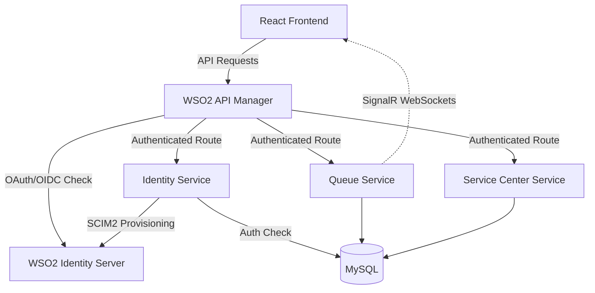

# Qlanka-pro: WSO2 Identity Server & API Manager Integration

Qlanka-Pro is an enterprise-grade smart queue management platform. This branch (`wso2`) features a full integration with the **WSO2 Identity Server 7.0** and **WSO2 API Manager 4.x**.

---

## 🔐 WSO2 Identity Server (OIDC/IdP)

The platform uses WSO2 Identity Server as the authoritative Identity Provider, shifting from manual JWT issuance to a standards-compliant OIDC flow.

### Identity Features
- **Authentication**: Backend-mediated **Resource Owner Password Credentials (ROPC)** flow.
- **Provisioning**: Automatic user mirroring from the local MySQL database to WSO2 IS via **SCIM 2.0**.
- **Asymmetric Validation**: Microservices validate tokens using WSO2's **JWKS endpoint**, ensuring security via public/private key pairs.
- **Dual-Scheme Auth**: A `DynamicJwt` policy allows both legacy local tokens and WSO2 tokens to coexist during transition periods.

---

## 🚀 WSO2 API Manager (Gateway & Governance)

All API traffic is governed by **WSO2 API Manager**, which acts as the primary entry point for the frontend and external clients.

### API Management Features
- **API Gateway**: Provides a single, secure endpoint for all microservices.
- **Rate Limiting & Throttling**: Protects backend services from spikes and abuse.
- **SignalR Support**: Dedicated WebSocket API definitions facilitate real-time queue updates.
- **Lifecycle Management**: APIs are versioned and managed through the WSO2 Publisher and Developer Portal.

---

## 🏗️ System Architecture



---

## 📂 Repository Structure

```
Qlanka-pro/
├── backend/
│   ├── QueueLanka.Identity/      # WSO2 IS Integration (ROPC/SCIM2)
│   ├── QueueLanka.Gateway/       # YARP Gateway (Secondary Entry Point)
│   ├── QueueLanka.Queue/         # Real-time Queue Service
│   └── QueueLanka.ServiceCenter/ # Service Center Management
├── frontend/
│   └── src/context/AuthContext.tsx # WSO2/OIDC Claim Normalization
└── deploy/
    └── wso2/                     # WSO2 IS & APIM Setup Guides
```

---

## 🛠️ Getting Started with WSO2

### 1. Configuration
Ensure the `Wso2` block is configured in your `appsettings.json` across all backend services:

```json
"Wso2": {
  "Enabled": true,
  "Authority": "https://20.193.250.12:9443",
  "Audience": "bOhc0ENWBPxvw_sXu8fxHv_Rz2Aa",
  "ClientId": "...",
  "ClientSecret": "...",
  "AdminPassword": "..."
}
```

### 2. Documentation
- **[WSO2 Setup Guide](deploy/wso2/README.md)**: Detailed steps for configuring Identity Server and API Manager.
- **[Original README](docs/README_ORIGINAL.md)**: Platform background and legacy architecture.

---

## 📊 Observability
Traffic passing through WSO2 APIM is monitored using the platform's integrated Prometheus/Grafana stack, providing insights into API latency, error rates, and usage patterns.

---

## 📸 Evidence

### API Publisher - Runtime Configurations


### Developer Portal - Production Keys


### API Publisher - Resources & Rate Limiting

