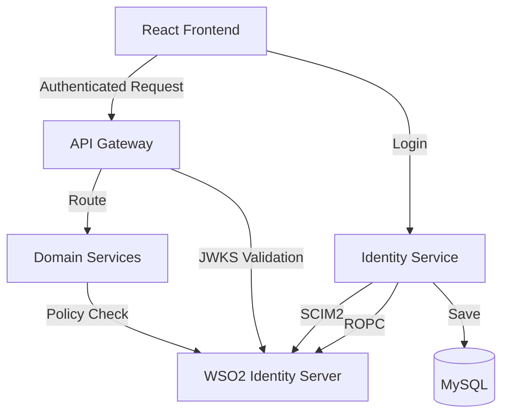

# Qlanka-pro: WSO2 Identity Server Integration

Qlanka-Pro is a smart queue management platform. This branch (`wso2`) features a full integration with **WSO2 Identity Server 7.0** as the authoritative OIDC/Identity Provider.

---

## 🔐 WSO2 Identity Server Integration

The manual symmetric-key JWT authentication has been replaced with a standards-compliant OIDC flow using WSO2 IS.

### High-Level Architecture
- **Identity Provider**: WSO2 IS 7.0 (Standalone on Azure)
- **Authentication Flow**: Backend-mediated **Resource Owner Password Credentials (ROPC)**.
- **User Provisioning**: Automatic **SCIM 2.0** mirroring from local MySQL to WSO2 IS.
- **Token Validation**: **Asymmetric JWKS-based validation** across all microservices.
- **Backward Compatibility**: Dual-scheme authentication allows both legacy local tokens and new WSO2 tokens.

### Core Components
- **Identity Service**: Now acts as a gateway to WSO2 IS. Uses `IWso2IdentityService` to exchange credentials for tokens and provision users via SCIM2.
- **API Gateway**: Validates all incoming Bearer tokens using WSO2's JWKS endpoint (`/oauth2/jwks`).
- **Domain Services (Queue/ServiceCenter)**: Implemented `DynamicJwt` policy to handle WSO2 tokens with role mapping.
- **Frontend**: `AuthContext.tsx` now handles normalized claim parsing for WSO2 JWT structures (`sub`, `roles`, `azp`).

---

## 🚀 Getting Started with WSO2

### 1. Prerequisites
- Access to WSO2 Identity Server: `https://20.193.250.12:9443`
- Configured Service Provider in WSO2 (ROPC enabled).
- Configured SCIM2 attributes.

### 2. Configuration
Update `appsettings.json` in `QueueLanka.Identity`, `QueueLanka.Gateway`, `QueueLanka.Queue`, and `QueueLanka.ServiceCenter`:

```json
"Wso2": {
  "Enabled": true,
  "Authority": "https://20.193.250.12:9443",
  "Audience": "bOhc0ENWBPxvw_sXu8fxHv_Rz2Aa",
  "ClientId": "...",
  "ClientSecret": "...",
  "AdminPassword": "..."
}
```

### 3. Setup Guide
For detailed configuration steps, see the **[WSO2 Setup Guide](deploy/wso2/README.md)**.

---

## 📂 Repository Structure

```
Qlanka-pro/
├── backend/
│   ├── QueueLanka.Identity/      # WSO2 SCIM2 & ROPC Logic
│   ├── QueueLanka.Gateway/       # JWKS Validation Chokepoint
│   ├── QueueLanka.Queue/         # WSO2 Auth Enabled
│   └── QueueLanka.ServiceCenter/ # WSO2 Auth Enabled
├── frontend/
│   └── src/context/AuthContext.tsx # WSO2 Claim Normalization
└── deploy/
    └── wso2/                     # WSO2 Integration Docs & Setup
```

---

## 🏗️ System Architecture



---

## 🛠️ Developer Workflow (WSO2 Branch)

1. **Authentication**: Use existing React forms. The backend handles the exchange.
2. **Claims**: WSO2 tokens use `sub` for user ID and a `roles` array. The system maps these to the internal `citizen`, `officer`, and `admin` roles.
3. **Provisioning**: Registering a user locally via the API automatically creates a corresponding user in WSO2 IS via SCIM2.

---

## 📄 Documentation

- **[Full WSO2 Implementation Guide](deploy/wso2/README.md)**
- **[Original Platform README](docs/README_ORIGINAL.md)** (Backup of legacy architecture)

---

## 📊 Observability

Metrics for WSO2 latency and authentication success rates are being integrated into the existing Prometheus/Grafana stack.
