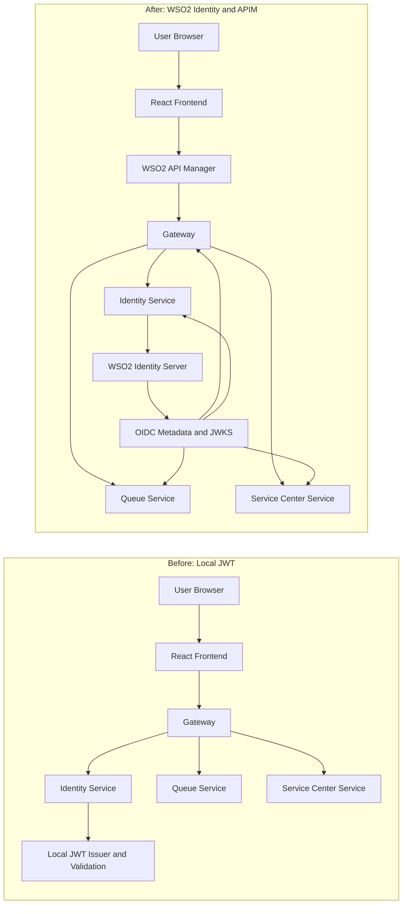
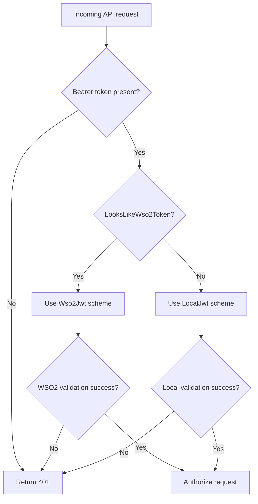
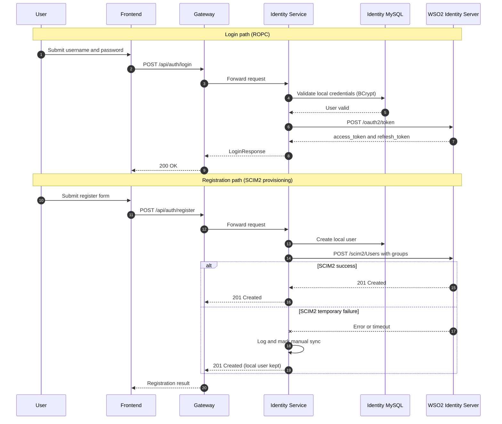

# We Did Not Just Change Login: We Rewired Trust Across Our Platform

At 2:13 AM, login started failing in staging.

Not for everyone. Not all the time. Just enough to trigger the worst kind of engineering stress: intermittent auth failures during a live migration.

On paper, our plan was simple. Move from locally issued JWTs to WSO2 Identity Server, keep the same frontend login flow, and add API governance through WSO2 API Manager.

In reality, we were not changing a screen. We were changing the trust model of an entire microservices platform.

This article is the full journey: what changed, why it worked, what almost broke, and the exact code patterns we used.

## Why we migrated

Our previous auth model worked, but it had scaling limits:

- Identity logic was tightly coupled to app code.
- Token trust was service-local.
- Claim and role consistency was fragile as the system grew.
- API governance depended on conventions instead of enforced policy.

We wanted:

- Standards-based identity with OAuth2 and OIDC.
- Asymmetric validation with JWKS.
- Controlled user provisioning.
- API publication and policy controls at the edge.

So we adopted:

- WSO2 Identity Server for token issuance and SCIM2 provisioning.
- WSO2 API Manager for API governance and lifecycle.

## Architecture shift

### Before

- Frontend called backend services.
- Services validated local symmetric JWTs.
- Identity concerns were spread across application code.

### After

- Identity service exchanges credentials with WSO2 and returns WSO2 tokens.
- Gateway and microservices validate WSO2 tokens through OIDC metadata/JWKS.
- API Manager handles published API governance.
- Registration provisions users to WSO2 via SCIM2.

## Mermaid diagram pack (curated 3)

Use only these three diagrams for Medium readability. Placement guidance is included so you can drop them into the right sections.

### Diagram 1: Before vs After architecture

Placement: directly after the "Architecture shift" section.



### Diagram 2: Dynamic dual JWT validation strategy

Placement: directly before the "Code snippet: DynamicJwt with LocalJwt + Wso2Jwt" section.



### Diagram 3: Login and registration sequence (ROPC + SCIM2)

Placement: directly before the "Login flow: local defense + WSO2 token authority" section.



## The migration strategy that saved us: dual JWT validation

A hard cutover would have been risky. Instead, we introduced a dynamic dual-scheme pipeline in each core backend service.

### Code snippet: DynamicJwt with LocalJwt + Wso2Jwt

```csharp
builder.Services
    .AddAuthentication(options =>
    {
        options.DefaultAuthenticateScheme = "DynamicJwt";
        options.DefaultChallengeScheme    = "DynamicJwt";
    })
    .AddPolicyScheme("DynamicJwt", "Dynamic JWT scheme", options =>
    {
        options.ForwardDefaultSelector = context =>
        {
            var authHeader = context.Request.Headers.Authorization.FirstOrDefault();
            var token = ExtractBearerToken(authHeader);
            if (!string.IsNullOrWhiteSpace(token) && LooksLikeWso2Token(token, wso2ValidIssuer))
                return "Wso2Jwt";
            return "LocalJwt";
        };
    })
    .AddJwtBearer("LocalJwt", options =>
    {
        options.TokenValidationParameters = new TokenValidationParameters
        {
            ValidateIssuer           = true,
            ValidateAudience         = true,
            ValidateLifetime         = true,
            ValidateIssuerSigningKey = true,
            ValidIssuer              = jwtIssuer,
            ValidAudience            = jwtAudience,
            IssuerSigningKey         = new SymmetricSecurityKey(Encoding.UTF8.GetBytes(jwtSecret)),
            ClockSkew                = TimeSpan.Zero
        };
    })
    .AddJwtBearer("Wso2Jwt", options =>
    {
        if (!wso2Enabled)
        {
            options.TokenValidationParameters = new TokenValidationParameters
            {
                ValidateIssuer           = true,
                ValidateAudience         = true,
                ValidateLifetime         = true,
                ValidateIssuerSigningKey = true,
                ValidIssuer              = jwtIssuer,
                ValidAudience            = jwtAudience,
                IssuerSigningKey         = new SymmetricSecurityKey(Encoding.UTF8.GetBytes(jwtSecret)),
                ClockSkew                = TimeSpan.Zero
            };
            return;
        }

        options.Authority            = wso2Authority;
        options.RequireHttpsMetadata = wso2RequireHttpsMetadata;
        options.MapInboundClaims     = false;

        if (wso2AllowInvalidCertificate)
        {
            options.BackchannelHttpHandler = new HttpClientHandler
            {
                ServerCertificateCustomValidationCallback = HttpClientHandler.DangerousAcceptAnyServerCertificateValidator
            };
        }

        options.TokenValidationParameters = new TokenValidationParameters
        {
            ValidateIssuer           = true,
            ValidateAudience         = true,
            ValidateLifetime         = true,
            ValidateIssuerSigningKey = true,
            ValidIssuer              = string.IsNullOrWhiteSpace(wso2ValidIssuer) ? null : wso2ValidIssuer,
            ValidAudience            = wso2Audience,
            RoleClaimType            = "role",
            ClockSkew                = TimeSpan.Zero
        };
    });
```

This gave us a low-risk path: old tokens and new tokens could coexist while we rolled out environment by environment.

## Login flow: local defense + WSO2 token authority

We intentionally kept local credential verification before calling WSO2. This reduced noisy IdP calls and enforced local account checks.

### Code snippet: AuthService login flow

```csharp
public async Task<LoginResponseDto> LoginAsync(LoginRequestDto dto)
{
    var user = await _users.GetByUsernameAsync(dto.Username);

    if (user is null || !BCrypt.Net.BCrypt.Verify(dto.Password, user.PasswordHash))
        throw new InvalidCredentialsException();

    if (!user.IsActive)
        throw new AccountDisabledException();

    var wso2Result = await _wso2.GetTokenAsync(dto.Username, dto.Password);

    int? counterId = null;
    if (user.Role.Equals("officer", StringComparison.OrdinalIgnoreCase))
    {
        var identityConnStr = _config.GetConnectionString("Default");
        if (!string.IsNullOrEmpty(identityConnStr))
        {
            var queueConnStr = identityConnStr.Replace("identity_db", "queue_db");
            using var conn = new MySqlConnector.MySqlConnection(queueConnStr);
            await conn.OpenAsync();
            const string sql = "SELECT counter_id FROM queue_db.counters WHERE assigned_officer_user_id = @UserId LIMIT 1";
            counterId = await Dapper.SqlMapper.QueryFirstOrDefaultAsync<int?>(conn, sql, new { UserId = user.UserId });
        }
    }

    return new LoginResponseDto
    {
        Token        = wso2Result.AccessToken,
        RefreshToken = wso2Result.RefreshToken,
        ExpiresIn    = wso2Result.ExpiresIn,
        Role         = user.Role.ToLowerInvariant(),
        CounterId    = counterId
    };
}
```

## Token exchange with WSO2 (ROPC)

Identity service now delegates token issuance to WSO2.

### Code snippet: GetTokenAsync against /oauth2/token

```csharp
public async Task<Wso2TokenResult> GetTokenAsync(string username, string password, CancellationToken ct = default)
{
    var tokenEndpoint = $"{BaseUrl}/oauth2/token";

    var body = new FormUrlEncodedContent(new Dictionary<string, string>
    {
        ["grant_type"] = "password",
        ["username"]   = username,
        ["password"]   = password,
        ["scope"]      = "openid profile",
        ["client_id"]     = ClientId,
        ["client_secret"] = ClientSecret
    });

    HttpResponseMessage response;
    try
    {
        response = await _http.PostAsync(tokenEndpoint, body, ct);
    }
    catch (HttpRequestException ex)
    {
        _logger.LogError(ex, "WSO2 IS token endpoint unreachable at {Endpoint}", tokenEndpoint);
        throw new AppException(503, "WSO2_UNAVAILABLE", "Identity server is temporarily unavailable. Please try again later.");
    }

    if (response.StatusCode == HttpStatusCode.Unauthorized || response.StatusCode == HttpStatusCode.BadRequest)
    {
        _logger.LogWarning("WSO2 ROPC rejected credentials for user {Username} - HTTP {Status}", username, response.StatusCode);
        throw new InvalidCredentialsException();
    }

    if (!response.IsSuccessStatusCode)
    {
        var errBody = await response.Content.ReadAsStringAsync(ct);
        _logger.LogError("WSO2 token endpoint returned {Status}: {Body}", response.StatusCode, errBody);
        throw new AppException(502, "WSO2_ERROR", "An error occurred with the identity provider.");
    }

    var tokenResponse = await response.Content.ReadFromJsonAsync<Wso2TokenResponse>(_jsonOpts, ct)
        ?? throw new AppException(502, "WSO2_PARSE_ERROR", "Failed to parse identity server response.");

    return new Wso2TokenResult(
        AccessToken:  tokenResponse.AccessToken,
        RefreshToken: tokenResponse.RefreshToken ?? string.Empty,
        ExpiresIn:    tokenResponse.ExpiresIn,
        Scope:        tokenResponse.Scope ?? string.Empty);
}
```

## Registration flow and SCIM2 provisioning

User creation now includes provisioning into WSO2. Role groups are mapped directly, and officer center context can be sent as a custom extension.

### Code snippet: ProvisionUserAsync via /scim2/Users

```csharp
public async Task ProvisionUserAsync(string username, string password, string email, string role, int? centerId = null, CancellationToken ct = default)
{
    var scim2Endpoint = $"{BaseUrl}/scim2/Users";

    var scimUser = new Dictionary<string, object?>
    {
        ["schemas"]  = new[] { "urn:ietf:params:scim:schemas:core:2.0:User" },
        ["userName"] = username,
        ["password"] = password,
        ["emails"]   = new[] { new { value = email, primary = true } },
        ["groups"]   = new[] { new { display = role, value = role } }
    };

    if (centerId.HasValue)
    {
        scimUser["urn:scim:wso2:qlanka:1.0"] = new { centerId = centerId.Value.ToString() };
    }

    var adminCredentials = Convert.ToBase64String(Encoding.UTF8.GetBytes($"{AdminUsername}:{AdminPassword}"));

    var jsonContent = new StringContent(
        JsonSerializer.Serialize(scimUser, _jsonOpts),
        Encoding.UTF8,
        "application/json");

    HttpResponseMessage response;
    try
    {
        var request = new HttpRequestMessage(HttpMethod.Post, scim2Endpoint)
        {
            Content = jsonContent
        };
        request.Headers.Authorization = new AuthenticationHeaderValue("Basic", adminCredentials);
        response = await _http.SendAsync(request, ct);
    }
    catch (HttpRequestException ex)
    {
        _logger.LogError(ex, "WSO2 IS SCIM2 endpoint unreachable at {Endpoint}", scim2Endpoint);
        _logger.LogWarning("User {Username} created in MySQL but WSO2 provisioning failed. Manual sync required.", username);
        return;
    }

    if (response.StatusCode == HttpStatusCode.Conflict)
    {
        _logger.LogWarning("WSO2 IS: User {Username} already exists - skipping SCIM2 creation.", username);
        return;
    }

    if (!response.IsSuccessStatusCode)
    {
        var errBody = await response.Content.ReadAsStringAsync(ct);
        _logger.LogError("WSO2 SCIM2 provisioning failed for {Username} - HTTP {Status}: {Body}",
            username, response.StatusCode, errBody);
    }
    else
    {
        _logger.LogInformation("WSO2 IS: User {Username} provisioned successfully with role {Role}.", username, role);
    }
}
```

## Frontend claim normalization during cutover

Token shapes differ between legacy local JWT and WSO2 tokens. We normalized role extraction to keep authorization stable.

### Code snippet: extractRole in frontend auth context

```ts
function extractRole(payload: JwtPayload, persistedRole?: string): string | undefined {
  const candidates: Array<string | string[] | undefined> = [
    payload.roles,
    payload.role,
    payload["http://schemas.microsoft.com/ws/2008/06/identity/claims/role"],
    persistedRole,
  ];

  for (const candidate of candidates) {
    if (!candidate) continue;
    if (Array.isArray(candidate)) {
      const appRole = candidate.find((r) =>
        ["citizen", "officer", "admin"].includes(r.toLowerCase())
      );
      if (appRole) return appRole.toLowerCase();
      if (candidate.length > 0) return candidate[0].toLowerCase();
    } else if (typeof candidate === "string" && candidate) {
      return candidate.toLowerCase();
    }
  }

  return undefined;
}
```

## API Manager integration

For APIM publication, we keep an import-ready API definition with WSO2 extensions in officer-api.yaml, including:

- x-wso2-application-security
- x-wso2-production-endpoints
- x-wso2-sandbox-endpoints
- x-wso2-basePath

This gives us API lifecycle and policy controls without coupling internal service routing to external API product design.

### Visual walkthrough (based on available screenshots)

Use the following six screenshots in this exact order.

1. WSO2 Publisher API Overview page (published state and lifecycle rail).
2. WSO2 Publisher dashboard showing all QueueLanka APIs.
3. WSO2 Publisher Endpoints page showing production and sandbox endpoint configuration.
4. WSO2 Publisher Resources page showing exposed route/method inventory.
5. WSO2 Dev Portal API catalog listing published APIs.
6. WSO2 Dev Portal application subscriptions page (consumer-side view).

Recommended captions:

1. "Publisher overview of QueueLanka Admin API in published state, with lifecycle and deployment progress visible."
2. "Publisher dashboard showing QueueLanka API portfolio and publication readiness."
3. "Endpoint configuration in Publisher with production and sandbox URLs mapped to deployed services."
4. "Resource-level API surface in Publisher, including admin counters and reporting endpoints."
5. "Developer Portal catalog where consumers discover QueueLanka APIs."
6. "Developer Portal application subscriptions showing published APIs bound to the frontend app."

Supporting sentence to include below these images:

"Publisher is our producer control plane (design, configure, publish); Dev Portal is our consumer plane (discover, subscribe, and use APIs)."

## What nearly broke during migration

1. Authority and issuer mismatch between services.
2. Certificate and metadata differences by environment.
3. Missing role claim mapping at the service provider level.

The fix was consistency: treat auth config as a contract across Gateway, Identity, Queue, and ServiceCenter.

## Screenshot checklist for this article

Use these in this exact order (aligned to available assets only).

1. Publisher API overview page (published state and lifecycle).
2. Publisher dashboard API list page.
3. Publisher endpoints configuration page.
4. Publisher resources page.
5. Dev Portal API catalog page.
6. Dev Portal application subscriptions page.

Note: the rest of the article (code snippets and architecture diagrams) remains valid without additional screenshots.

## Publish-ready closing

This migration was not an auth refactor. It was a trust refactor.

By moving token issuance to WSO2, validating centrally through OIDC metadata/JWKS, and introducing API governance through APIM, we made the platform more secure, more consistent, and more resilient to scale.

The biggest lesson: do not treat identity migration as a single feature. Treat it as a platform transition, and design the rollout path as carefully as the target architecture.

## Suggested Medium title options

1. We Did Not Just Change Login: How We Rewired Trust with WSO2 in a .NET Microservices Platform
2. From Local JWT to WSO2 OIDC: A Real Migration Story from Production
3. How We Integrated WSO2 Identity Server and API Manager Without Breaking Microservices Auth

## Tags

#dotnet #microservices #wso2 #oauth2 #oidc #apimanagement #architecture #react #security #devops
